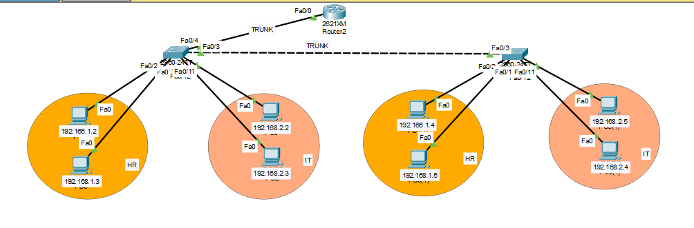

# Inter-VLAN Routing Lab

A Cisco Packet Tracer project demonstrating how devices in separate VLANs can communicate through a router.

This lab models two departments—**HR** and **IT**—on separate IP networks. The switches use trunk links to carry VLAN traffic, and the router provides routing between the networks. The included configuration files and screenshots document the setup and its connectivity checks.

## Lab Objectives

- Separate department traffic using VLANs.
- Assign switch ports to the appropriate VLAN.
- Carry multiple VLANs across trunk links.
- Configure router-based communication between VLANs.
- Verify the network using interface checks and ping tests.

## Network Overview

The topology contains two switches, one router, and eight PCs. The HR hosts use the `192.168.1.0` network, while IT hosts use the `192.168.2.0` network.

| Department | VLAN | Network | Host IP addresses |
|---|---:|---|---|
| HR | 10 | `192.168.1.0` | `192.168.1.2`–`192.168.1.5` |
| IT | 11 | `192.168.2.0` | `192.168.2.2`–`192.168.2.5` |

The topology screenshot provides a visual overview of the device connections and departmental groups.

## Topology



## Routing and Switching

The switches connect to each other through a trunk link. A trunk link also connects a switch to the router, allowing traffic from both VLANs to reach the router. The router then routes traffic between the HR and IT networks.

The device configurations are included in the `configuration/` folder:

- `Router.txt`
- `Switch1.txt`
- `Switch2.txt`

Review these files alongside the Packet Tracer project to see how the routing and switching setup is applied.

## Verification

The screenshots in `Screenshots/` provide evidence of the lab configuration and connectivity tests:

- `show_vlan_brief.PNG` — VLAN information
- `show_interface_trunk.PNG` — trunk status
- `show_ip_int_brief.PNG` — interface status and IP information
- `Successful_ping(Vlan10_to_Vlan10).PNG` — ping test from VLAN 10 to VLAN 10
- `Successful_ping(Vlan10_to_Vlan11).PNG` — ping test from VLAN 10 to VLAN 11
- `Successful_ping(Vlan11_to_Vlan10).PNG` — ping test from VLAN 11 to VLAN 10

Together, these checks help confirm VLAN membership, trunk operation, interface status, and connectivity between the networks.

## Repository Contents

```text
Inter_VLAN_Routing/
├── README.md
├── Screenshots/
│   ├── README.md
│   ├── Successful_ping(Vlan10_to_Vlan10).PNG
│   ├── Successful_ping(Vlan10_to_Vlan11).PNG
│   ├── Successful_ping(Vlan11_to_Vlan10).PNG
│   ├── Topology.PNG
│   ├── show_interface_trunk.PNG
│   ├── show_ip_int_brief.PNG
│   └── show_vlan_brief.PNG
├── configuration/
│   ├── README.md
│   ├── Router.txt
│   ├── Switch1.txt
│   └── Switch2.txt
└── packet-tracer/
    ├── README.md
    └── inter_vlan_routing_lab.pkt
```

## Open the Project

1. Open the repository’s `packet-tracer/` folder.
2. Download `inter_vlan_routing_lab.pkt`.
3. Open the file in Cisco Packet Tracer.
4. Inspect the device configurations and compare them with the files in `configuration/`.
5. Review the screenshots in `Screenshots/` to see the topology and verification results.

## Summary

This project demonstrates how VLANs can separate departmental networks while router-based inter-VLAN routing enables communication between them. The Packet Tracer file, device configurations, and verification screenshots are provided so the lab can be explored and reviewed.
